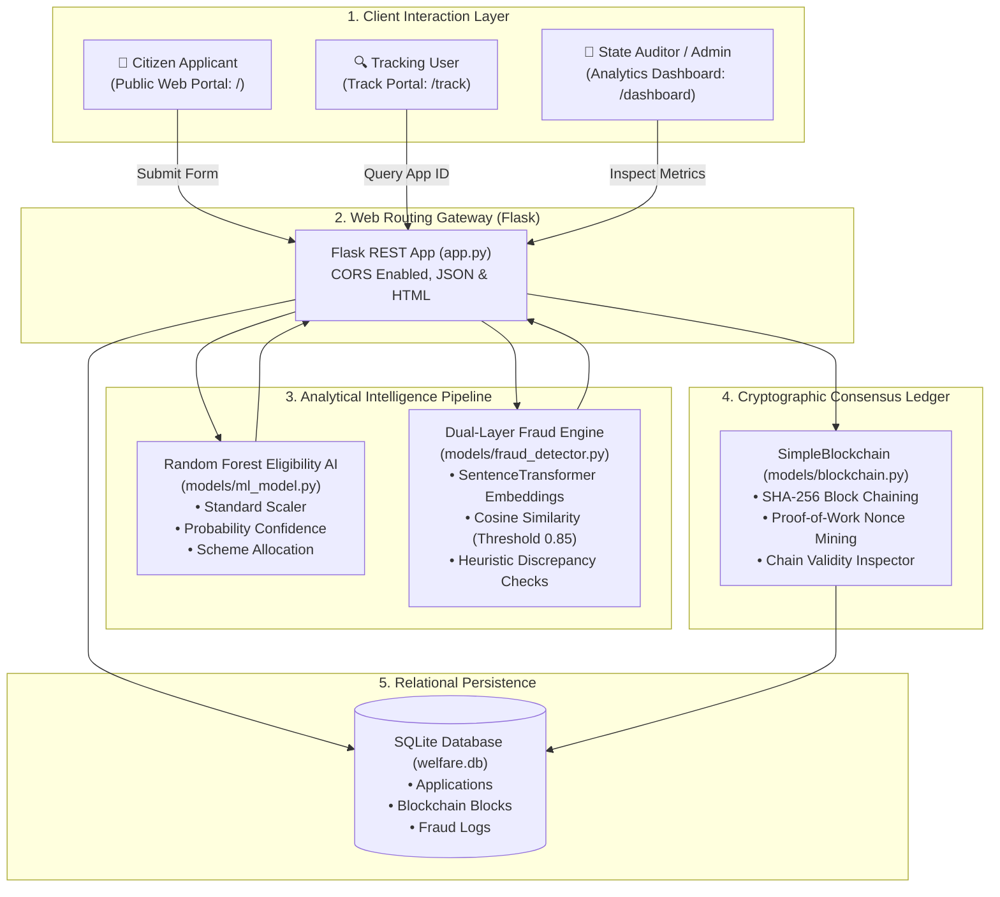
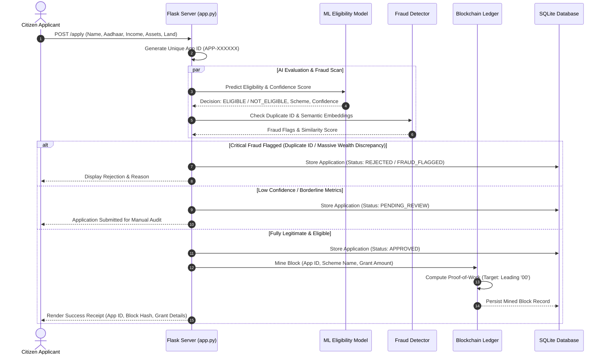

# 🏛️ Autonomous Beneficiary Scheme Distribution System

[](https://www.python.org/)
[](https://flask.palletsprojects.com/)
[](https://scikit-learn.org/)
[](https://www.sbert.net/)
[](models/blockchain.py)
[](database.py)
[](LICENSE)

> An autonomous, tamper-proof welfare distribution platform that eliminates bureaucratic corruption, ghost beneficiaries, and administrative leakage through **Machine Learning Eligibility Classification**, **Dense Semantic NLP Fraud Detection**, and an **Immutable SHA-256 Proof-of-Work Blockchain Audit Ledger**.

---

## 📋 Table of Contents

- [1. Executive Summary & Problem Context](#1-executive-summary--problem-context)
- [2. Architectural Blueprint](#2-architectural-blueprint)
- [3. End-to-End Processing Pipeline](#3-end-to-end-processing-pipeline)
- [4. Deep Dive: Machine Learning Eligibility Classifier](#4-deep-dive-machine-learning-eligibility-classifier)
  - [4.1 Model Architecture & Feature Weights](#41-model-architecture--feature-weights)
  - [4.2 Scheme Allocation Engine](#42-scheme-allocation-engine)
- [5. Deep Dive: Dual-Layer Fraud Detection Engine](#5-deep-dive-dual-layer-fraud-detection-engine)
  - [5.1 Semantic Dense Embedding Similarity](#51-semantic-dense-embedding-similarity)
  - [5.2 Heuristic Financial Discrepancy Rules](#52-heuristic-financial-discrepancy-rules)
- [6. Deep Dive: Custom SHA-256 Blockchain Ledger](#6-deep-dive-custom-sha-256-blockchain-ledger)
  - [6.1 Block Anatomy & Cryptographic Chaining](#61-block-anatomy--cryptographic-chaining)
  - [6.2 Proof-of-Work (PoW) Mining Algorithm](#62-proof-of-work-pow-mining-algorithm)
  - [6.3 Tamper Verification & Chain Auditability](#63-tamper-verification--chain-auditability)
- [7. Database Schema & Tables](#7-database-schema--tables)
- [8. Complete REST API & Route Documentation](#8-complete-rest-api--route-documentation)
- [9. Directory & File Organization](#9-directory--file-organization)
- [10. Installation, Setup & Execution Guide](#10-installation-setup--execution-guide)
- [11. Comprehensive Automated Test Suite](#11-comprehensive-automated-test-suite)
- [12. Author & License](#12-author--license)

---

## 1. Executive Summary & Problem Context

Government Direct Benefit Transfer (DBT) and welfare distribution schemes worldwide lose billions of dollars annually to administrative leakage, identity fraud, middleman corruption, and ghost beneficiaries. Citizens eligible for life-saving assistance are frequently trapped in months of bureaucratic red tape, while fraudulent applications slip through undetected due to fragmented identity databases.

The **Autonomous Beneficiary Scheme Distribution System** re-engineers welfare delivery into a fully automated, objective, and auditable pipeline:
1. **Zero Human Bias in Eligibility**: A multi-dimensional Random Forest classifier evaluates applicants objectively based on verified socioeconomic indicators.
2. **Combating Ghost & Duplicate Identity Theft**: Semantic embeddings (`all-MiniLM-L6-v2`) combined with identity deduplication detect fraudulent submissions even when names or addresses are slightly obfuscated.
3. **Immutable Accountability**: Decisions cannot be covertly reversed, modified, or backdated. Every grant is mined into a cryptographic Proof-of-Work blockchain block, creating an unalterable public ledger of all state disbursements.

---

## 2. Architectural Blueprint



---

## 3. End-to-End Processing Pipeline



---

## 4. Deep Dive: Machine Learning Eligibility Classifier

The classification module (`models/ml_model.py`) evaluates socioeconomic telemetry to determine eligibility with statistical confidence.

### 4.1 Model Architecture & Feature Weights

- **Algorithm**: `RandomForestClassifier` (100 estimators, max depth 10, random state 42).
- **Preprocessing**: `StandardScaler` fitted across standard feature distributions.
- **Input Feature Vector**:

$$\vec{x} = \begin{bmatrix}
\text{Annual Income (₹)} \\
\text{Family Size} \\
\text{Age} \\
\text{Dependents} \\
\text{Location Index (0: Urban, 1: Rural, 2: Tribal)} \\
\text{Agricultural Land Holdings (Acres)} \\
\text{Liquid Bank Balance (₹)} \\
\text{Motor Vehicle Ownership (0 or 1)}
\end{bmatrix}$$

**Inference Decision Logic**:
- Generates a class probability score $P(\text{Eligible} \mid \vec{x}) \in [0.0, 1.0]$.
- If $P \ge 0.50$, beneficiary is flagged as **Eligible**.
- If $P \ge 0.75$, confidence is labeled **High**.
- If $0.50 \le P < 0.75$, confidence is labeled **Medium**.
- If $P < 0.50$, beneficiary is flagged as **Not Eligible**.

### 4.2 Scheme Allocation Engine

Once deemed eligible, the system assigns the optimal scheme and grant amount:

| Socioeconomic Profile | Allocated Welfare Scheme | Disbursed Grant Amount |
|---|---|---|
| Agricultural Land $> 0$ Acres & Rural Location | **PM-KISAN Farmer Support Scheme** | **₹25,000** |
| Age $\ge 60$ Years & Income $< ₹1,50,000$ | **Senior Citizen Pension Scheme** | **₹18,000** |
| Annual Income $< ₹1,00,000$ & Family Size $> 4$ | **National Food Security & BPL Direct Benefit** | **₹30,000** |
| General Vulnerability Baseline | **Direct Cash Assistance Program** | **₹12,000** |

---

## 5. Deep Dive: Dual-Layer Fraud Detection Engine

The fraud detection engine (`models/fraud_detector.py`) combines deterministic identity indexing with dense semantic vector similarity.

### 5.1 Semantic Dense Embedding Similarity
Fraudulent applicants often attempt to bypass deduplication by slightly altering their name spelling, father's name, or localized address formatting.
1. The engine constructs a descriptive narrative document:
   ```text
   Name: <name> | Aadhaar: <aadhaar> | Income: <income> | Family: <family_size> | Location: <loc>
   ```
2. Passes the document through the **`all-MiniLM-L6-v2` Sentence Transformer**, generating a 384-dimensional dense vector $\vec{v}_{\text{new}}$.
3. Computes the cosine similarity against all historical records $\vec{v}_{\text{existing}}$:
   $$\text{Similarity}(\vec{u}, \vec{v}) = \frac{\vec{u} \cdot \vec{v}}{\|\vec{u}\| \|\vec{v}\|}$$
4. If $\text{Similarity} > 0.85$, the application is flagged with `🚨 High semantic similarity with existing applicant`.

### 5.2 Heuristic Financial Discrepancy Rules

In addition to semantic checks, deterministic sanity checks catch fraudulent wealth concealment:
- **Rule 1 (Duplicate Identity)**: Identical citizen Aadhaar number already registered $\rightarrow$ **Immediate Auto-Rejection (`CRITICAL`)**.
- **Rule 2 (Vehicle on Subsidized Income)**: Declared income $< ₹50,000$ while owning a registered four-wheel motor vehicle $\rightarrow$ **Flagged for Fraud Audit (`HIGH`)**.
- **Rule 3 (Liquid Wealth Discrepancy)**: Declared below-poverty-line income with liquid bank balance $> ₹5,00,000$ $\rightarrow$ **Flagged for Audit (`CRITICAL`)**.

---

## 6. Deep Dive: Custom SHA-256 Blockchain Ledger

The audit ledger (`models/blockchain.py`) maintains an unalterable chronological record of disbursements.

### 6.1 Block Anatomy & Cryptographic Chaining

Every block is structured as a immutable JSON dictionary:

```json
{
  "index": 1,
  "timestamp": 1741703210.421,
  "data": {
    "app_id": "APP-984210",
    "name": "Rajesh Kumar",
    "scheme": "PM-KISAN Farmer Support Scheme",
    "grant_amount": 25000,
    "decision": "APPROVED",
    "timestamp": "2026-09-11 15:30:00"
  },
  "previous_hash": "00a4b9c1d2e3f4a5b6c7d8e9f0a1b2c3d4e5f6a7b8c9d0e1f2a3b4c5d6e7f8a9",
  "nonce": 421,
  "hash": "00f12c8b4e7a912389dcae98412ef176ab123098feac12398401294812039481"
}
```

$$\text{Block Hash} = \text{SHA-256}\Big(\text{SortKeys}\big(\text{Index} \mathbin{\Vert} \text{Timestamp} \mathbin{\Vert} \text{Data} \mathbin{\Vert} \text{PrevHash} \mathbin{\Vert} \text{Nonce}\big)\Big)$$

### 6.2 Proof-of-Work (PoW) Mining Algorithm
To prevent malicious flooding or rapid rewriting of the database:
- Mining difficulty is calibrated to `difficulty = 2`.
- The miner loops incrementing the integer `nonce` until the resulting hexadecimal hash begins with `00`:
  ```python
  while not computed_hash.startswith("0" * self.difficulty):
      block['nonce'] += 1
      computed_hash = self.calculate_hash(block)
  ```

### 6.3 Tamper Verification & Chain Auditability
The `is_chain_valid()` routine traverses the entire ledger from Genesis block to current tip:
1. Re-computes the hash of each block and checks for discrepancies against the stored `hash`.
2. Verifies that `block[i].previous_hash == block[i-1].hash`.
3. If an attacker modifies an approved grant amount directly in SQLite, the block hash becomes invalid, breaking all downstream cryptographic links.

---

## 7. Database Schema & Tables

The SQLite database (`welfare.db`) contains two primary tables initialized via `database.py`:

```sql
-- 1. Applications Master Table
CREATE TABLE IF NOT EXISTS applications (
    id INTEGER PRIMARY KEY AUTOINCREMENT,
    app_id TEXT UNIQUE NOT NULL,
    name TEXT NOT NULL,
    aadhaar TEXT NOT NULL,
    income INTEGER NOT NULL,
    family_size INTEGER NOT NULL,
    age INTEGER NOT NULL,
    dependents INTEGER NOT NULL,
    location INTEGER NOT NULL,
    land_acres REAL NOT NULL,
    bank_balance INTEGER NOT NULL,
    has_vehicle INTEGER NOT NULL,
    eligible INTEGER NOT NULL,
    confidence REAL NOT NULL,
    scheme_name TEXT NOT NULL,
    grant_amount INTEGER NOT NULL,
    decision TEXT NOT NULL,
    fraud_flags TEXT,
    created_at TIMESTAMP DEFAULT CURRENT_TIMESTAMP
);

-- 2. Blockchain Blocks Table
CREATE TABLE IF NOT EXISTS blockchain (
    id INTEGER PRIMARY KEY AUTOINCREMENT,
    block_index INTEGER UNIQUE NOT NULL,
    timestamp REAL NOT NULL,
    data TEXT NOT NULL,
    previous_hash TEXT NOT NULL,
    hash TEXT NOT NULL,
    nonce INTEGER NOT NULL,
    created_at TIMESTAMP DEFAULT CURRENT_TIMESTAMP
);
```

---

## 8. Complete REST API & Route Documentation

### 8.1 Submit Welfare Application
- **`POST /apply`** (HTML Form or REST payload)
```json
// Form / JSON Body
{
  "name": "Sunita Devi",
  "aadhaar": "9876-5432-1098",
  "income": 45000,
  "family_size": 5,
  "age": 38,
  "dependents": 3,
  "location": 1,
  "land_acres": 0.5,
  "bank_balance": 12000,
  "has_vehicle": 0
}

// Redirects to /status/<app_id> or returns Success HTML with:
// - Application ID: APP-309142
// - Decision: APPROVED
// - Scheme: National Food Security & BPL Direct Benefit
// - Grant Amount: ₹30,000
// - Block Index: #4
// - Block Hash: 00b48a...
```

### 8.2 Track Application Status
- **`GET /track/<app_id>`**
```json
// Response Payload
{
  "app_id": "APP-309142",
  "name": "Sunita Devi",
  "decision": "APPROVED",
  "scheme_name": "National Food Security & BPL Direct Benefit",
  "grant_amount": 30000,
  "blockchain_record": {
    "block_index": 4,
    "hash": "00b48a192c7301984abcdef...",
    "previous_hash": "0082f19a012...",
    "mined_at": "2026-09-11 15:35:12"
  }
}
```

### 8.3 Administrative Overview
- **`GET /dashboard`**
  - Aggregates total applications, total funds disbursed, approval percentage, pending review queue, and active fraud alerts.
- **`GET /blockchain`**
  - Visual blockchain explorer rendering block headers, parent links, nonces, and mined payloads.

---

## 9. Directory & File Organization

```text
autonomous_beneficiary_scheme_distribution_system/
├── models/
│   ├── blockchain.py                # SHA-256 Proof-of-Work blockchain implementation
│   ├── fraud_detector.py            # SentenceTransformer semantic & heuristic fraud detector
│   ├── ml_model.py                  # RandomForestClassifier & StandardScaler pipeline
│   ├── test_blockchain.py           # Unit tests for block hashing, PoW, and tamper detection
│   ├── welfare_model.pkl            # Serialized trained scikit-learn model
│   └── welfare_model_scaler.pkl     # Serialized StandardScaler
├── static/
│   └── style.css                    # Professional responsive stylesheets & layout
├── templates/
│   ├── base.html                    # Shared header, navigation bar, and footer
│   ├── blockchain.html              # Blockchain explorer with real-time hash viewer
│   ├── dashboard.html               # Administrative executive analytics dashboard
│   ├── error.html                   # Error boundary and warning display
│   ├── index.html                   # Citizen-facing application submission form
│   ├── status.html                  # Detailed application decision review
│   ├── success.html                 # Instant grant confirmation receipt & block hash
│   └── track.html                   # Public tracking search portal
├── app.py                           # Main Flask application and REST controllers
├── database.py                      # SQLite database driver and query routines
├── setup_models.py                  # Script to train, calibrate, and save ML model binaries
├── test_database.py                 # SQLite database unit tests
├── test_integration.py              # Full end-to-end integration test suite
├── test_models.py                   # Machine learning prediction unit tests
└── welfare.db                       # Active SQLite relational database
```

---

## 10. Installation, Setup & Execution Guide

### Prerequisites
- Python 3.10 or higher
- `pip` package manager

### Step-by-Step Installation

```bash
# 1. Clone the repository
git clone https://github.com/HarshM-Workspace/autonomous_beneficiary_scheme_distribution_system.git
cd autonomous_beneficiary_scheme_distribution_system

# 2. Create and activate a Python virtual environment
python -m venv venv
# Windows:
venv\Scripts\activate
# Linux/macOS:
source venv/bin/activate

# 3. Install required packages
pip install flask flask-cors scikit-learn numpy pandas joblib sentence-transformers

# 4. (Optional) Re-train and generate fresh ML model binaries
python setup_models.py

# 5. Launch the Flask server
python app.py
```

The application will start at **`http://localhost:5000`**.

---

## 11. Comprehensive Automated Test Suite

The repository includes a complete test harness verifying each subsystem:

```bash
# 1. Validate Blockchain Cryptography & Proof-of-Work
python -m unittest models/test_blockchain.py

# 2. Validate ML Classifier Predictions & Edge Cases
python -m unittest test_models.py

# 3. Validate SQLite Database Operations
python -m unittest test_database.py

# 4. Run Full End-to-End Integration Suite
python test_integration.py
```

---

## 12. Author & License

- **Author**: Harsh Mishra ([@HarshM-Workspace](https://github.com/HarshM-Workspace))
- **License**: MIT License — see [LICENSE](LICENSE) for details.
